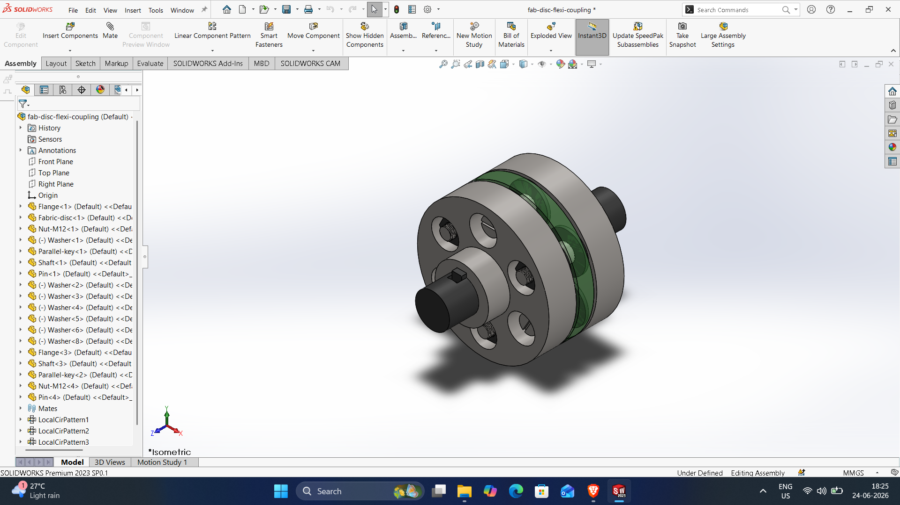
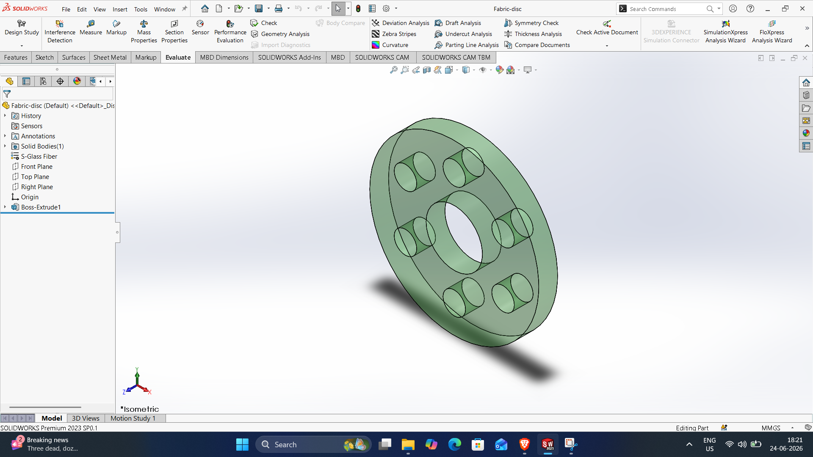
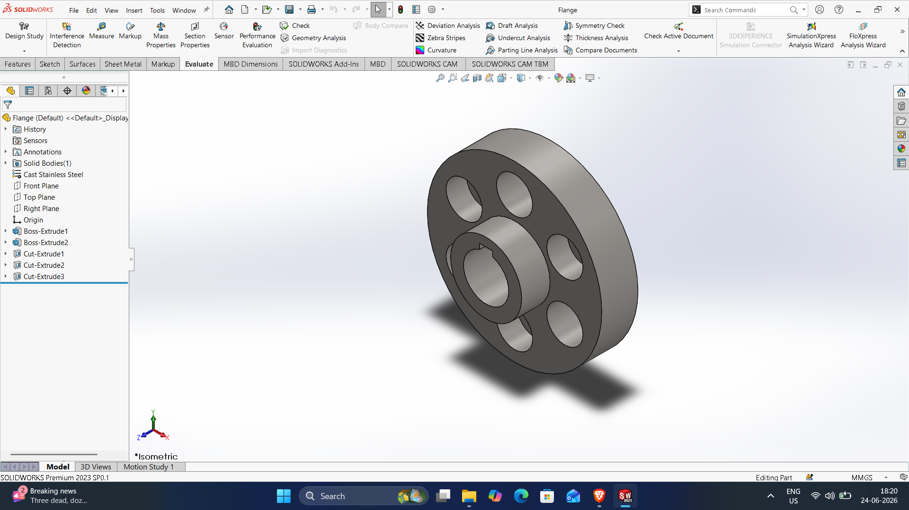
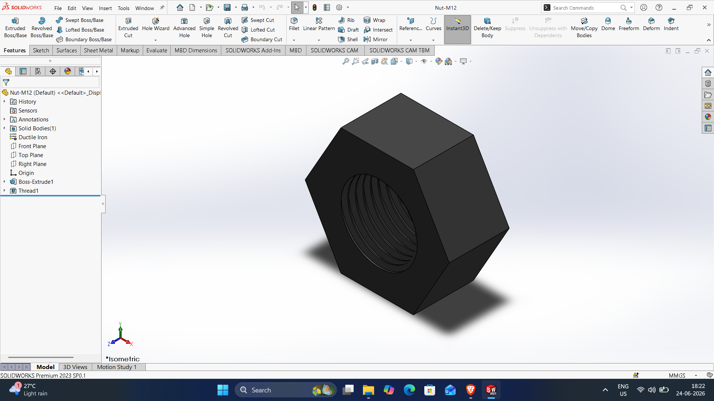
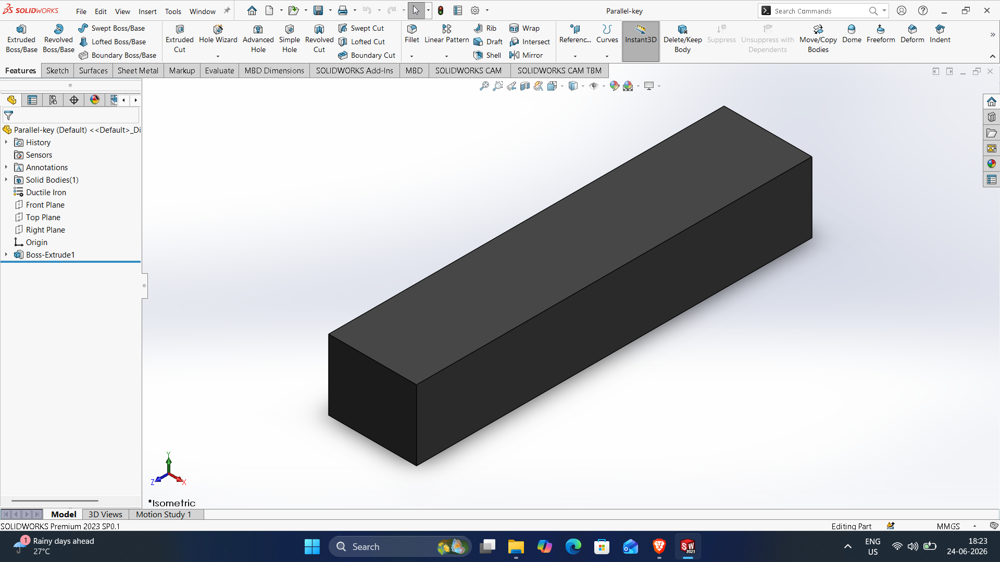
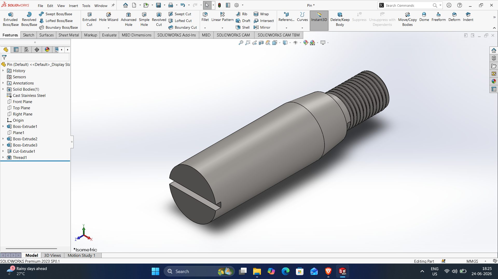
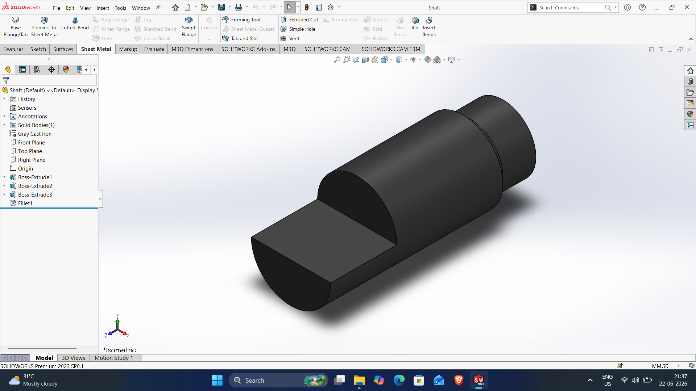
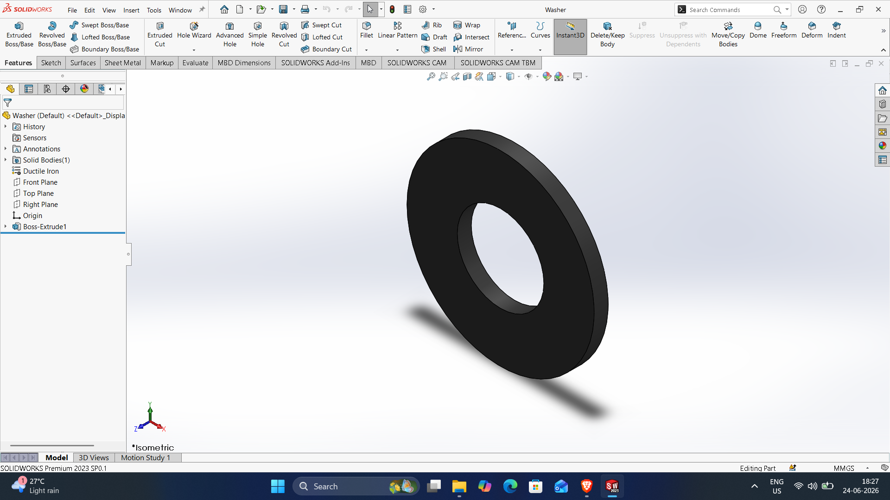

# Fab-disc-flexi-coupling

DWG file: Fab-disc-flexi-coupling.SLDPRT

# Fabri-disc

DWG file: Fabri-disc.SLDPRT

# Flange

DWG file: Flange.SLDPRT

# Nut-M12

DWG file: Nut-M12.SLDPRT

# Parallel-key

DWG file: Parallel-key.SLDPRT

# Pin

DWG file: Pin.SLDPRT

# Shaft

DWG file: Shaft.SLDPRT

# Washer

DWG file: Washer.SLDPRT
