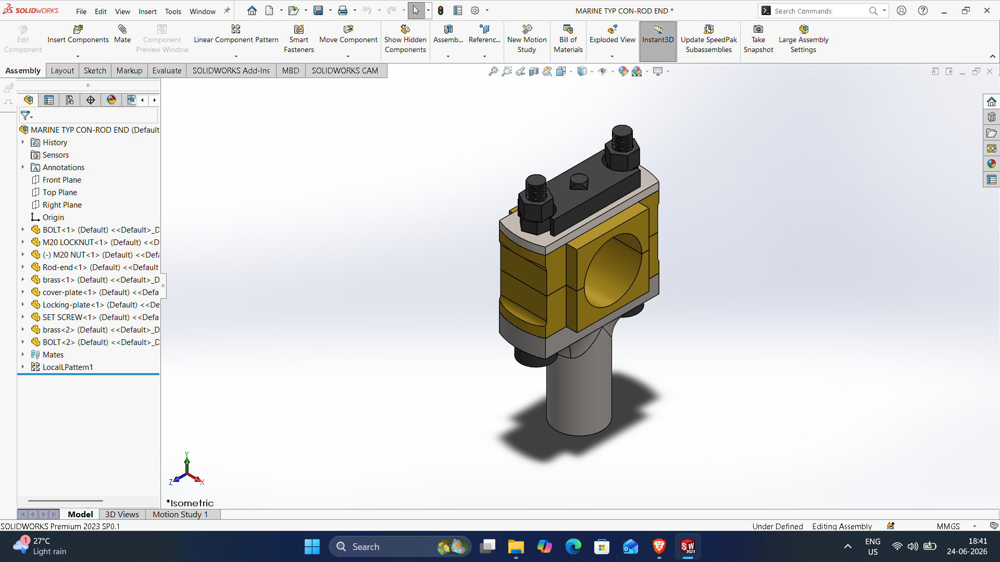
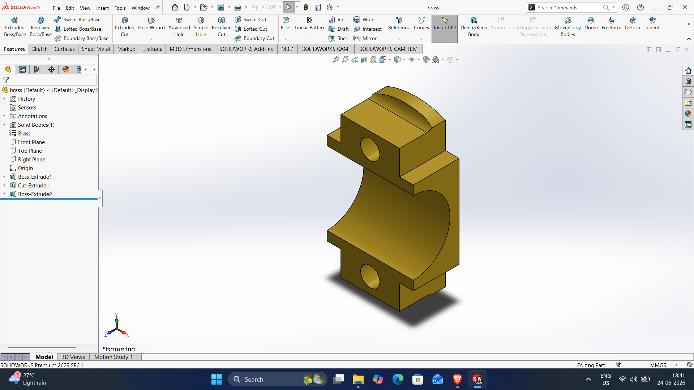
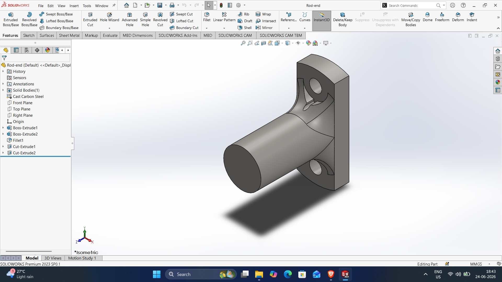
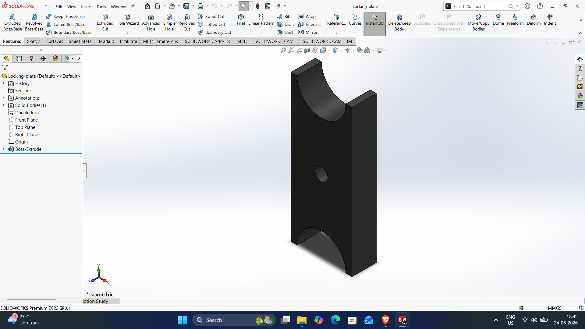
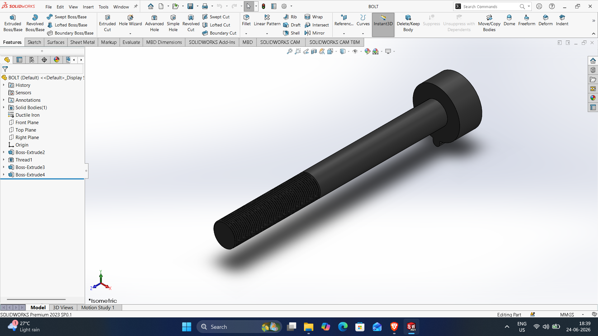
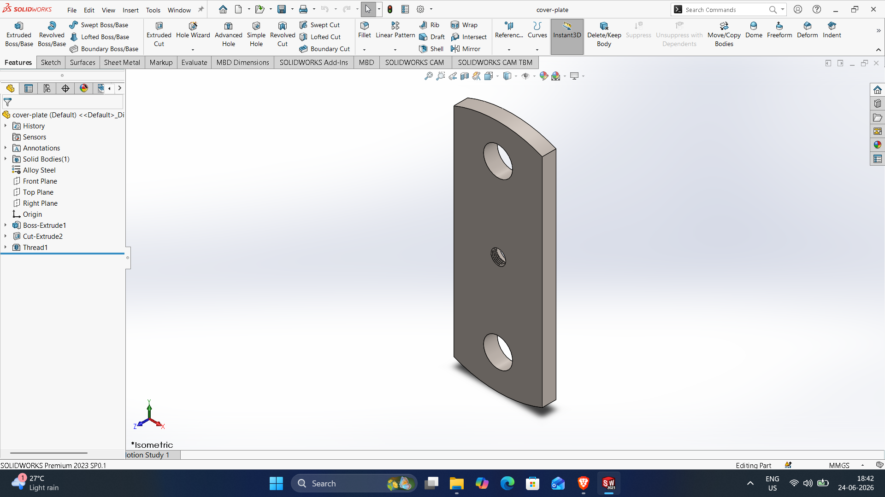
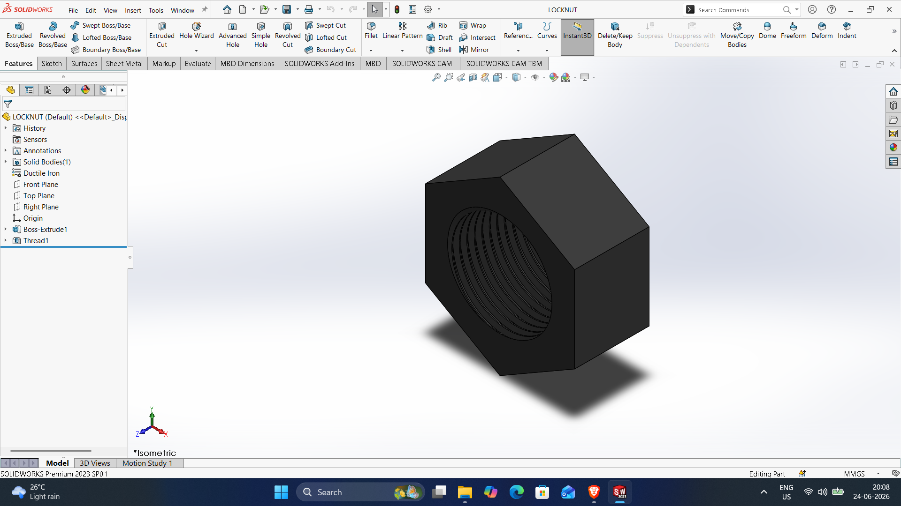
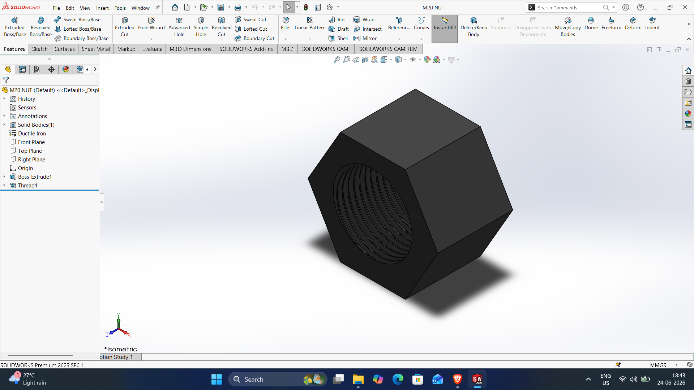
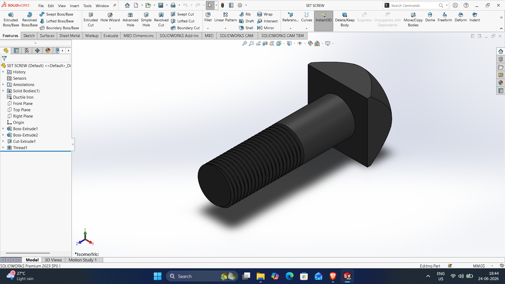

Marine typ con rod end Assembly
# Marine-typ-con-rod-end

DWG file: Marine-typ-con-rod-end.SLDASM

# Brass

DWG file: Brass.SLDPRT

# Rod-end

DWG file: Rod-end.SLDPRT

# Locking-plate

DWG file: Locking-plate.SLDPRT

# Bolt

DWG file: Bolt.SLDPRT

# Cover-plate

DWG file: Cover-plate.SLDPRT

# Locknut

DWG file: Locknut.SLDPRT

# M20-Nut

DWG file: M20-Nut.SLDPRT

# Set-screw

DWG file: Set-screw.SLDPRT
