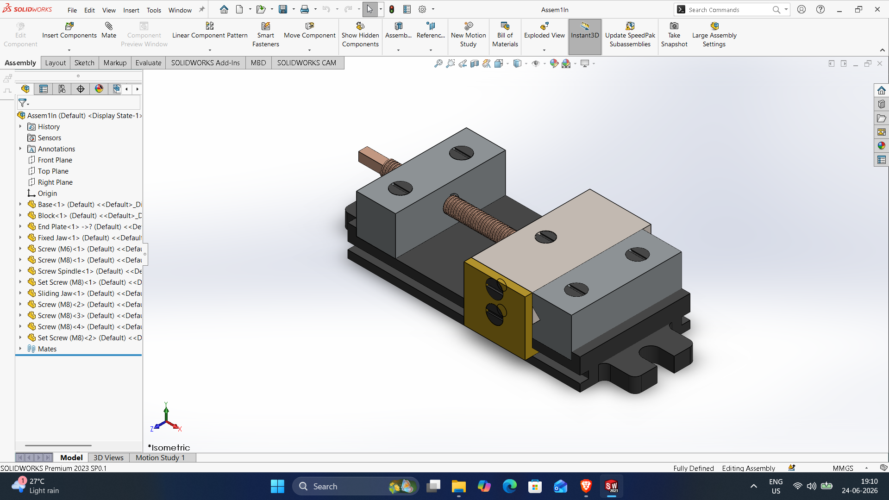
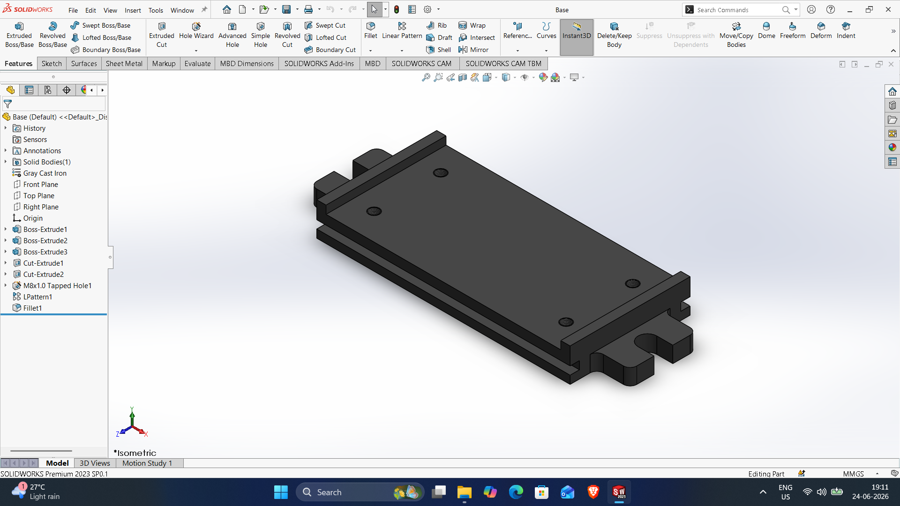
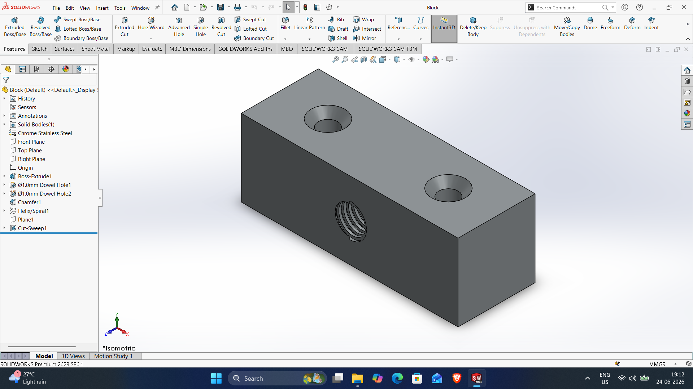
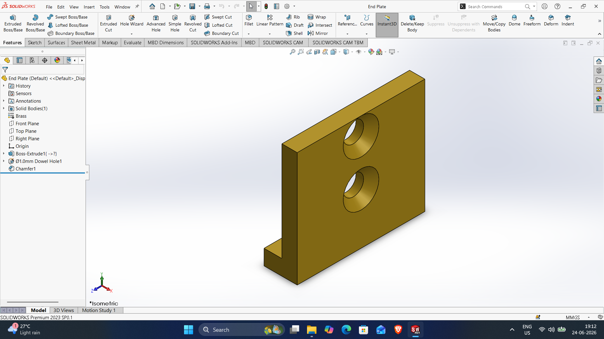
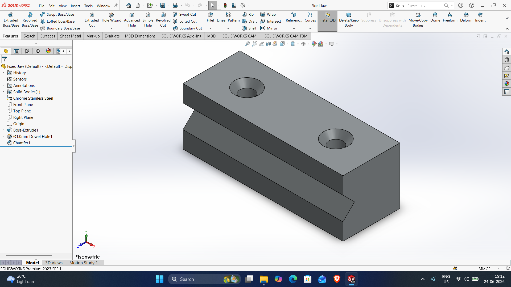
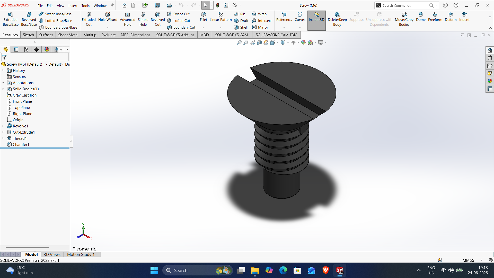
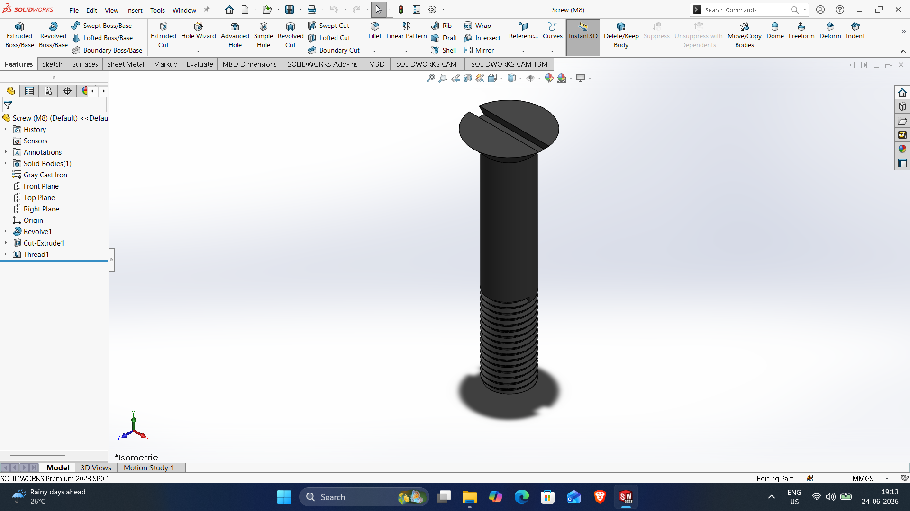
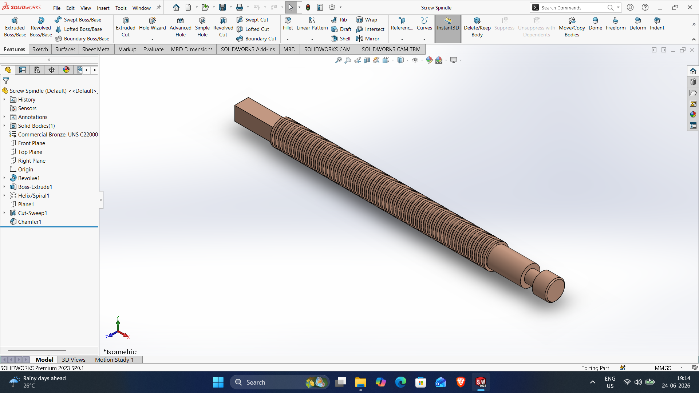
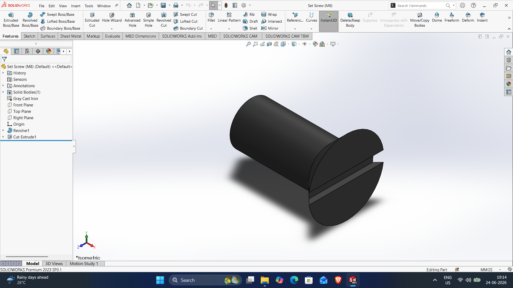
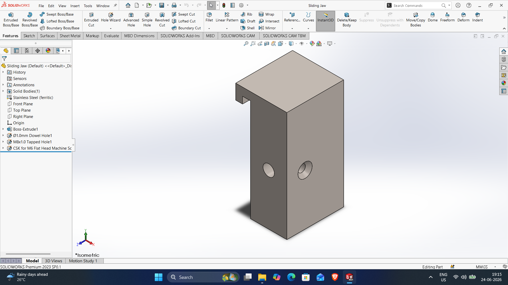

# SOLIDWORKS-ASSEMBLY-FILES
# Machine-Vice-assembly

DWG file: Machine-Vice-assembly.SLDASM

# Base

DWG file: Base.SLDPRT

# Block

DWG file: Block.SLDPRT

# End-plate

DWG file: End-plate.SLDPRT

# Fixed-jaw

DWG file: Fixed-jaw.SLDPRT

# Screw-M6

DWG file: Screw-M6.SLDASM

# Screw-M8

DWG file: Screw-M8.SLDPRT

# Screw-Spindle

DWG file: Screw-Spindle.SLDPRT

# Set-Screw-M8

DWG file: Set-Screw-M8.SLDPRT

# Sliding-jaw

DWG file: Sliding-jaw.SLDPRT
