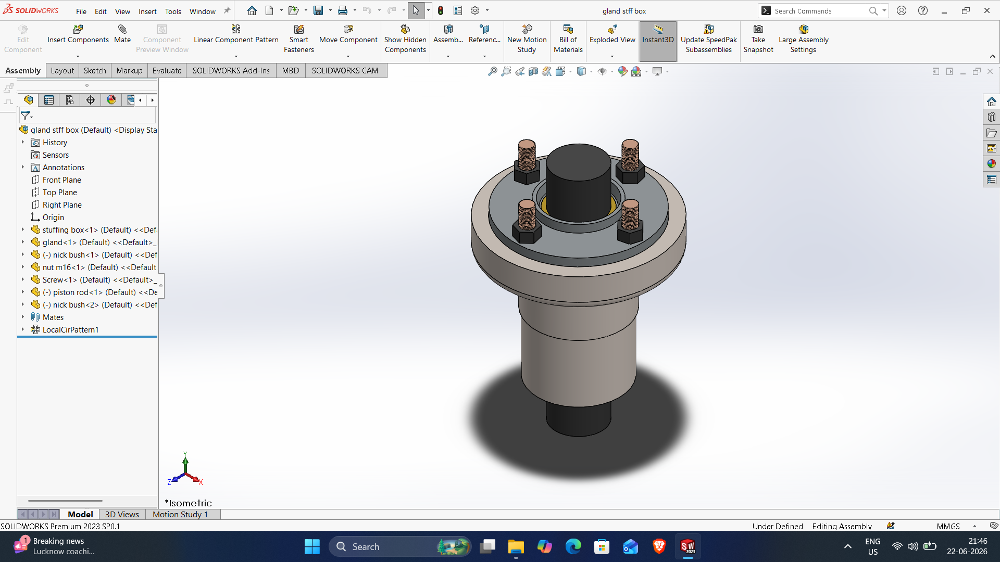
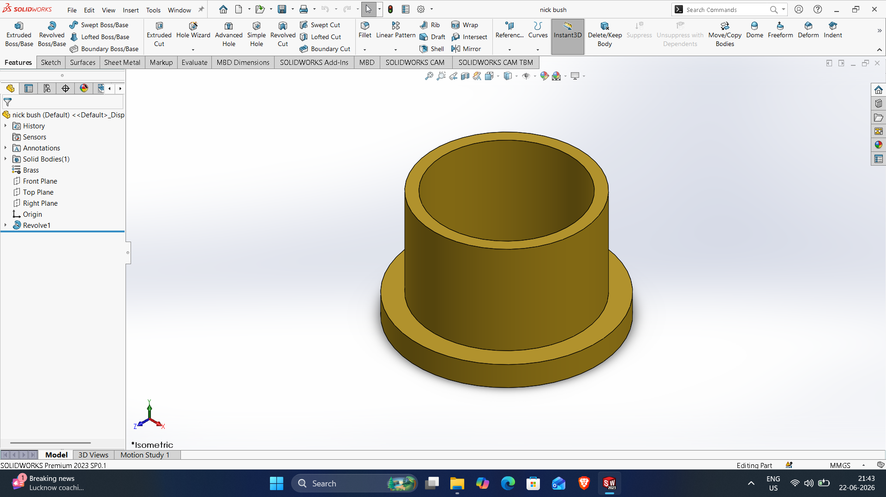
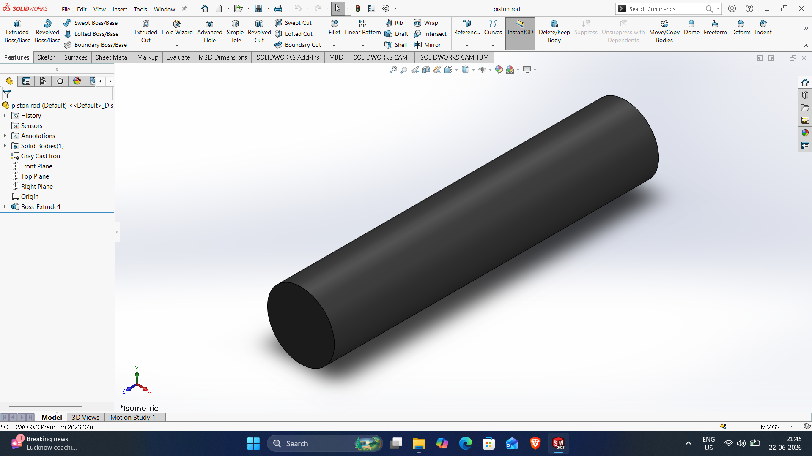
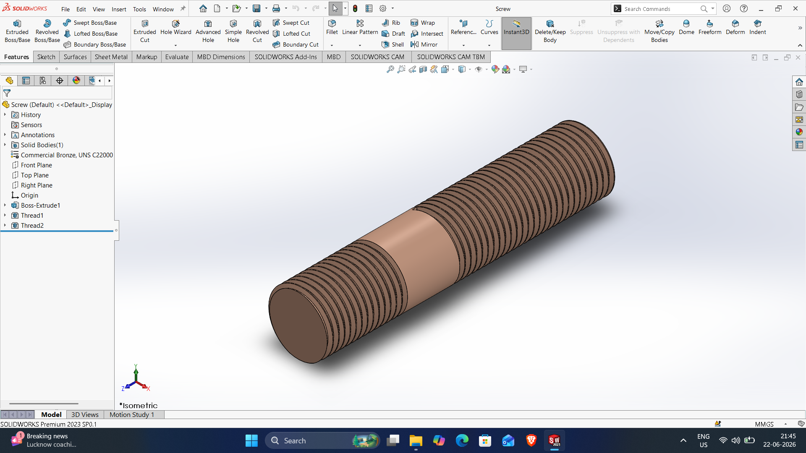
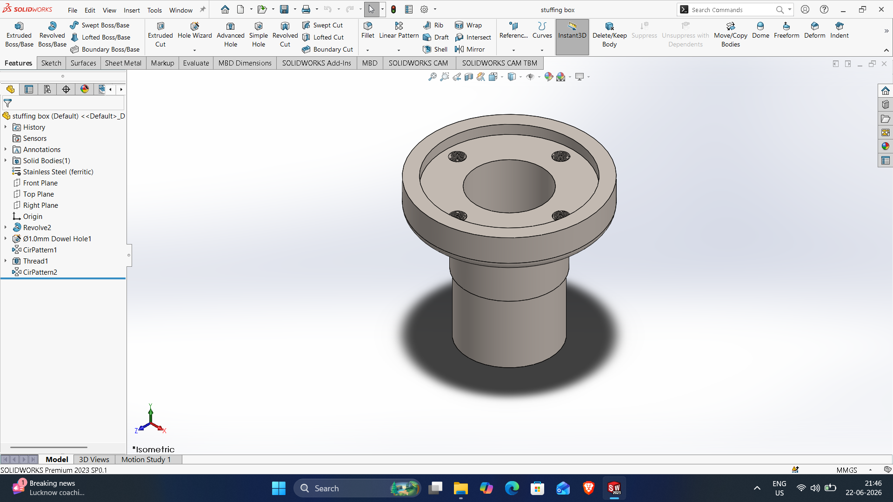

# SOLIDWORKS-ASSEMBLY-FILES
# Gland-stff-box-assembly

DWG file: Gland-stff-box-assembly.SLDASM

# Gland

DWG file: Gland.SLDPRT

# nick-bush

DWG file: nick-bush.SLDPRT

# nut-m16

DWG file: nut-m16.SLDPRT

# piston-rod

DWG file: piston-rod.SLDPRT

# Screw

DWG file: Screw.SLDPRT

# Stuffing-box

DWG file: Stuffing-box.SLDPRT
