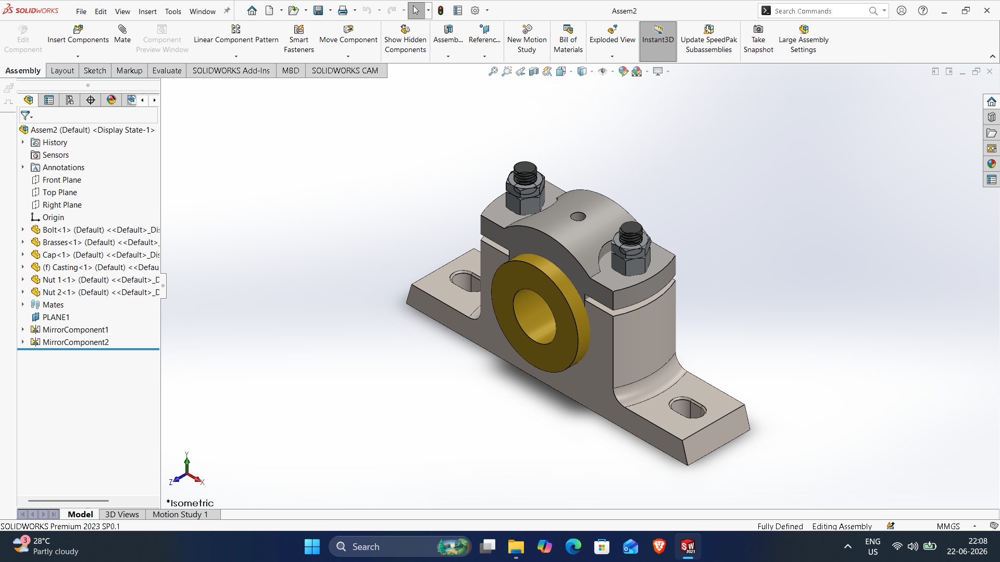
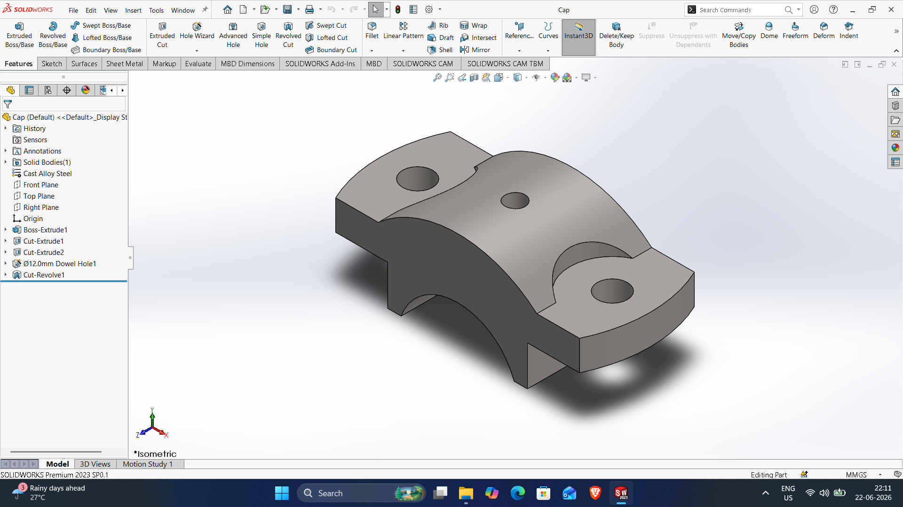
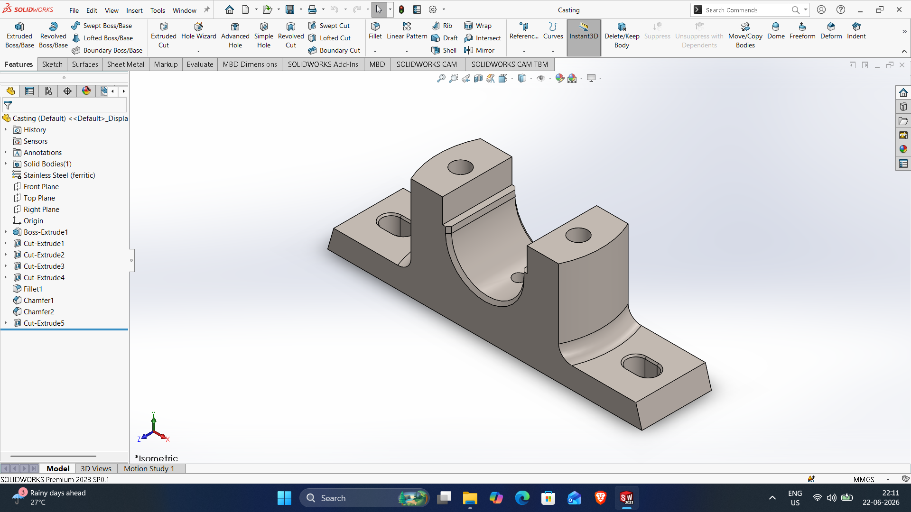
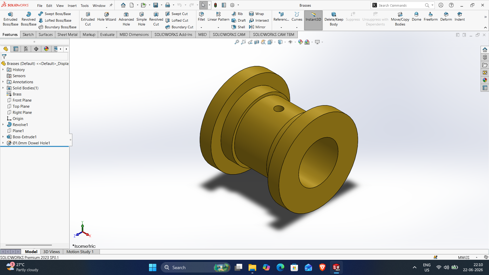
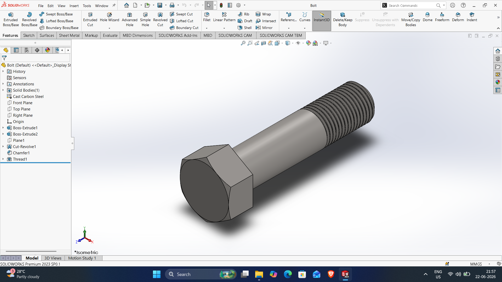
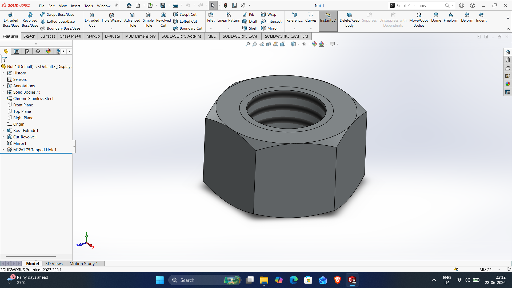
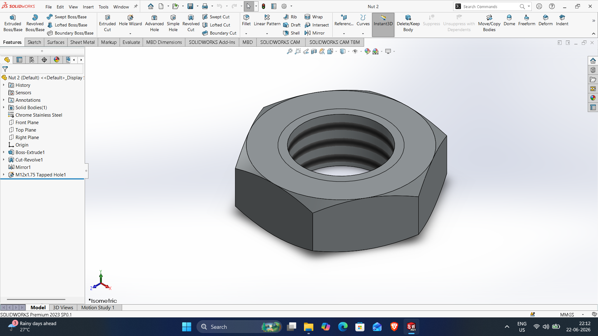

# SOLIDWORKS-ASSEMBLY-FILES

# plummer-block-assembly

DWG file: plummer-block-assembly.SLDPRT

# cap

DWG file: cap.SLDPRT

# casting

DWG file: casting.SLDPRT

# brasses

DWG file: brasses.SLDPRT

# bolt

DWG file: bolt.SLDPRT

# nut1

DWG file: nut1.SLDPRT

# nut2

DWG file: nut2.SLDPRT
