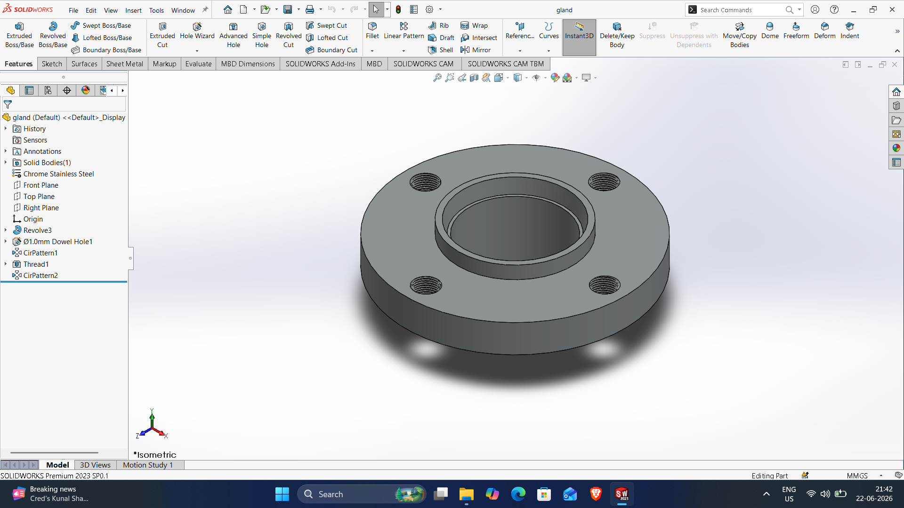

# SOLIDWORKS-ASSEMBLY-FILES

# Gland

DWG file: Gland.SLDPRT

# Gland

DWG file: Gland.SLDPRT

# Gland

DWG file: Gland.SLDPRT

# Gland

DWG file: Gland.SLDPRT

# Gland

DWG file: Gland.SLDPRT

# Gland

DWG file: Gland.SLDPRT

# Gland

DWG file: Gland.SLDPRT
