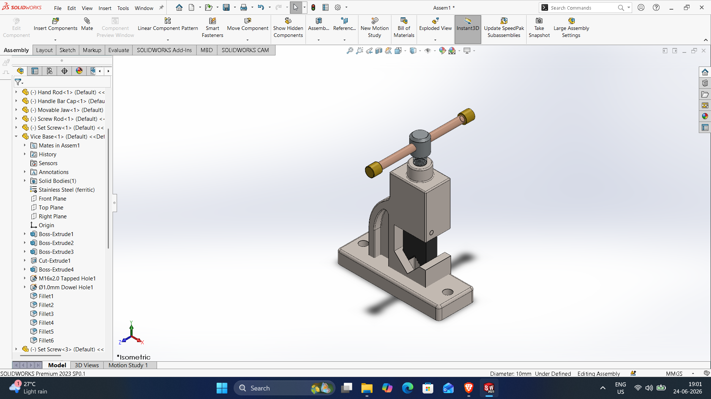
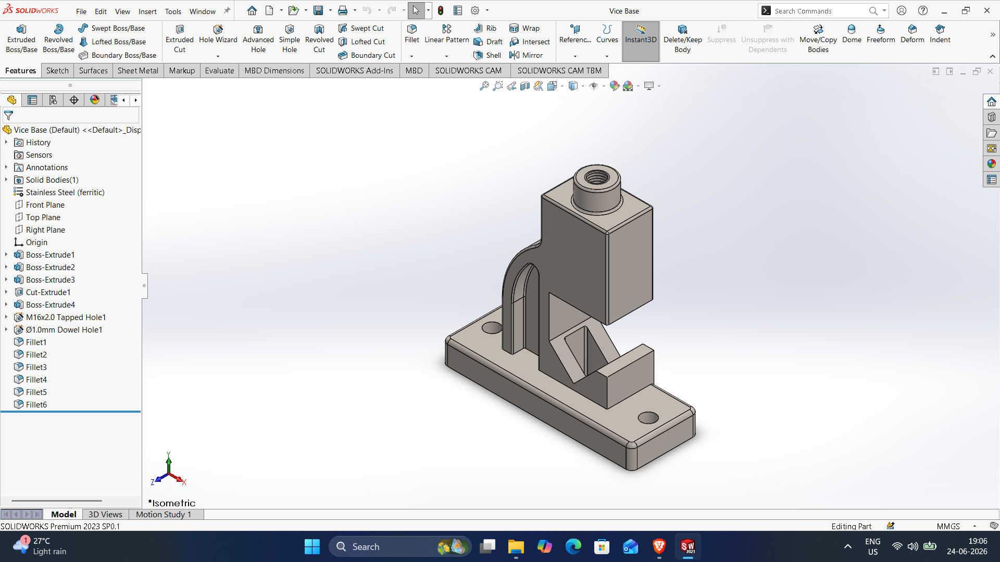
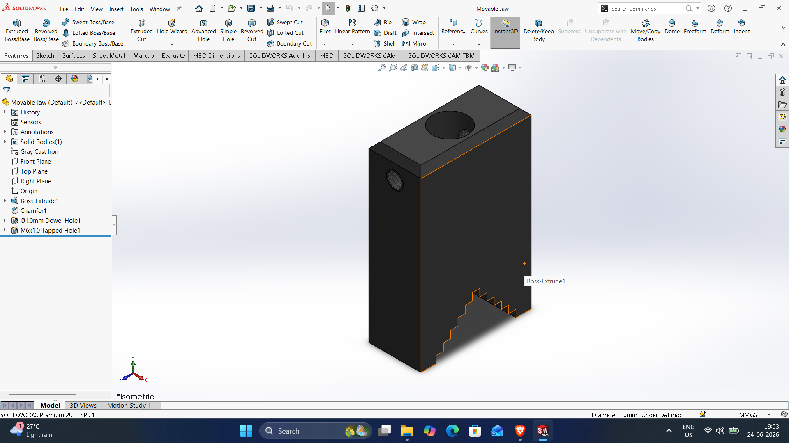
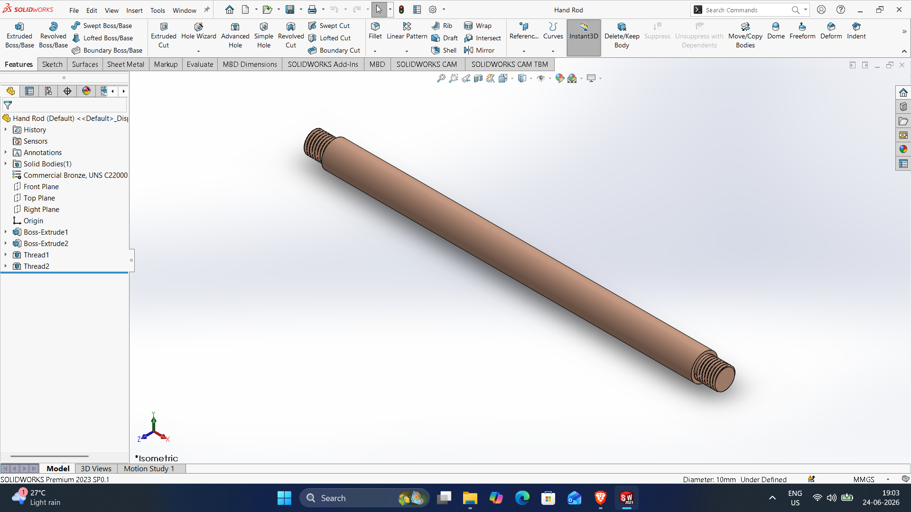
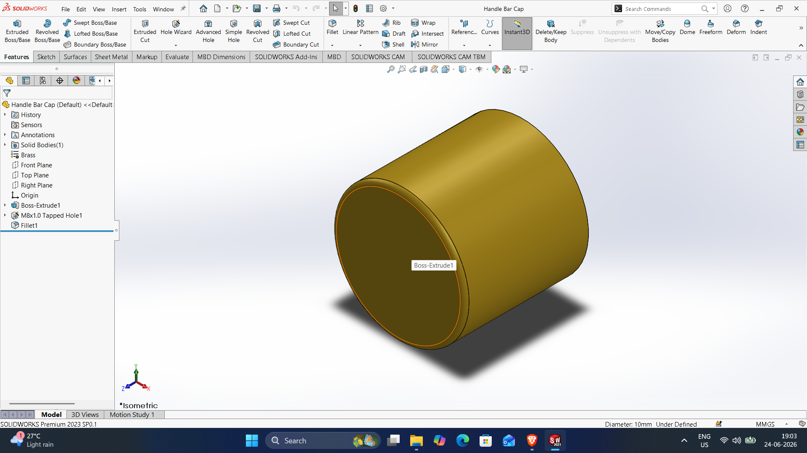
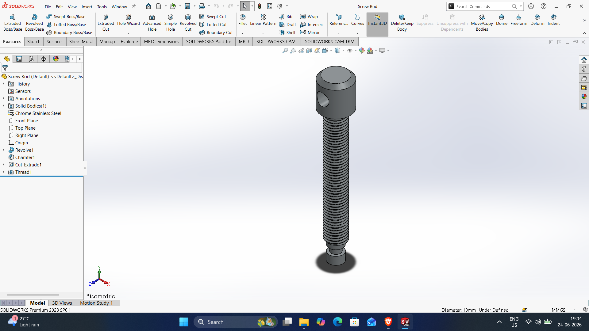
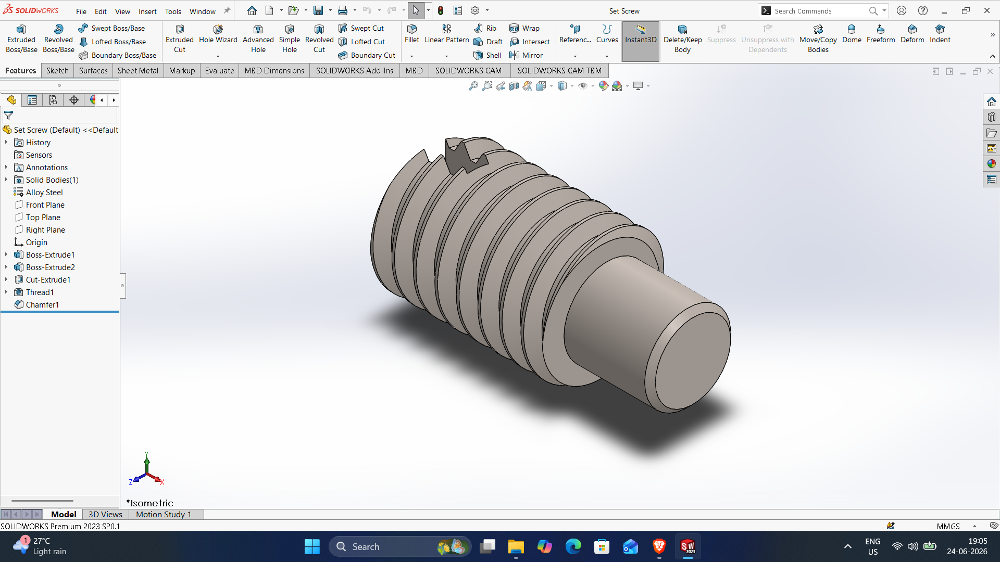

# SOLIDWORKS-ASSEMBLY-FILES
# Pipe-vice-assembly

DWG file: Pipe-vice-assembly.SLDASM

# Vice-Base

DWG file: Vice-Base.SLDASM

# Movable-jaw

DWG file: Movable-jaw.SLDASM

# Hand-rod

DWG file: Hand-rod.SLDASM

# Hand-bar-cap

DWG file: Hand-bar-cap.SLDASM

# Screw-rod

DWG file: Screw-rod.SLDASM

# Set-Screw

DWG file: Set-Screw.SLDASM
