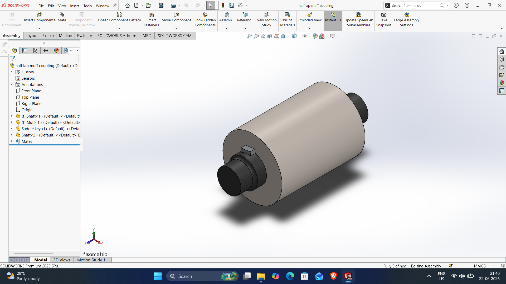
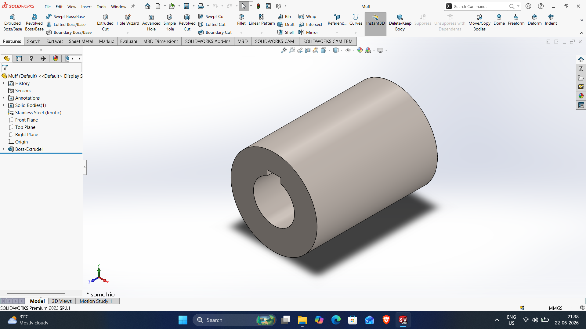
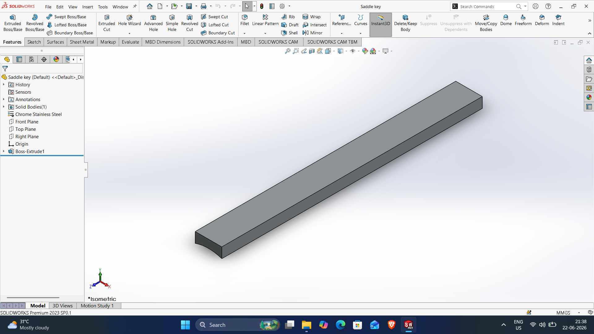

# SOLIDWORKS-ASSEMBLY-FILES
# HAFF-LAP-MUFF-COUPLING-ASSEMBLY

DWG file: HAFF-LAP-MUFF-COUPLING-ASSEMBLY.SLDASM

# Muff

DWG file: Muff.SLDPRT

# Saddle-key

DWG file: Saddle-key.SLDPRT

# Shaft

DWG file: Shaft.SLDPRT

