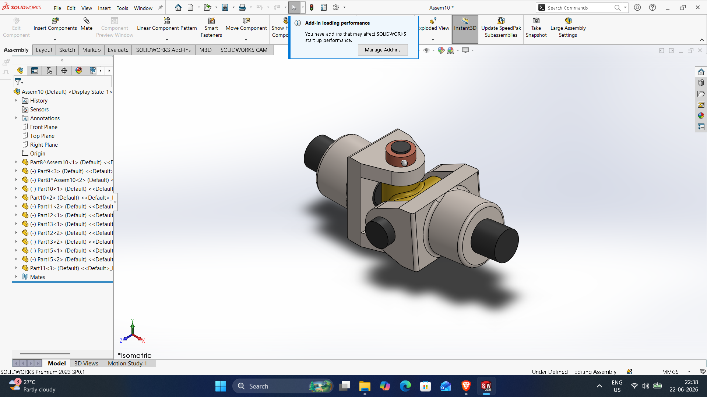
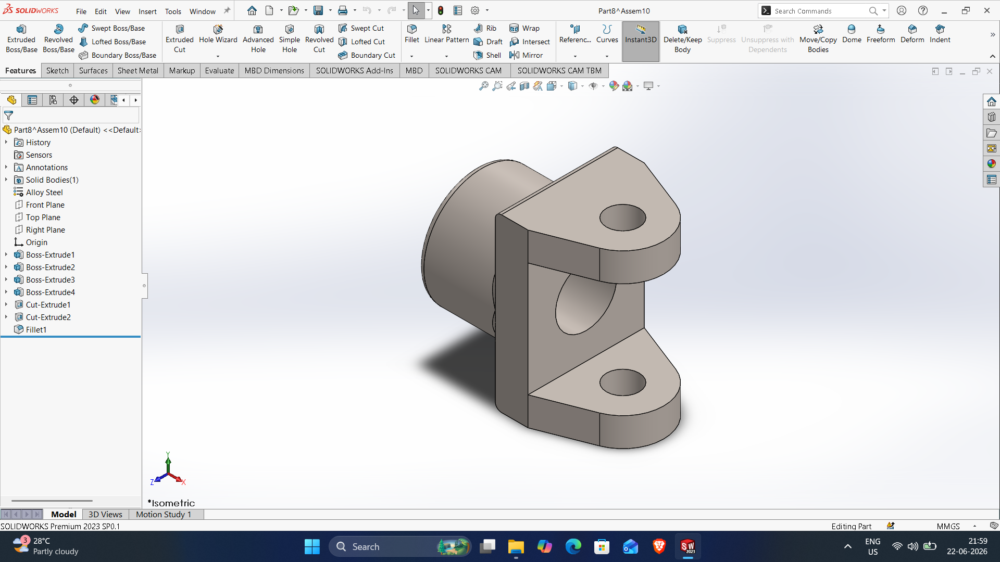
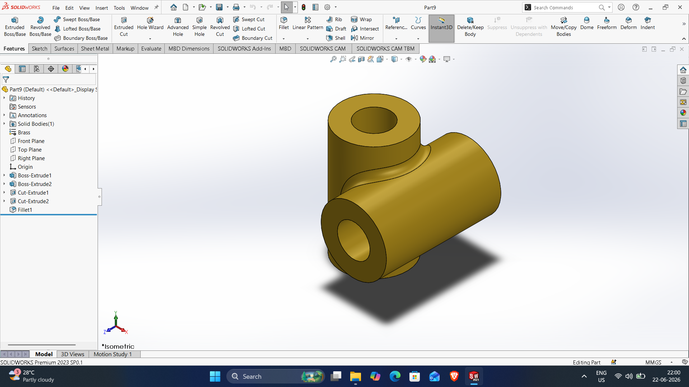
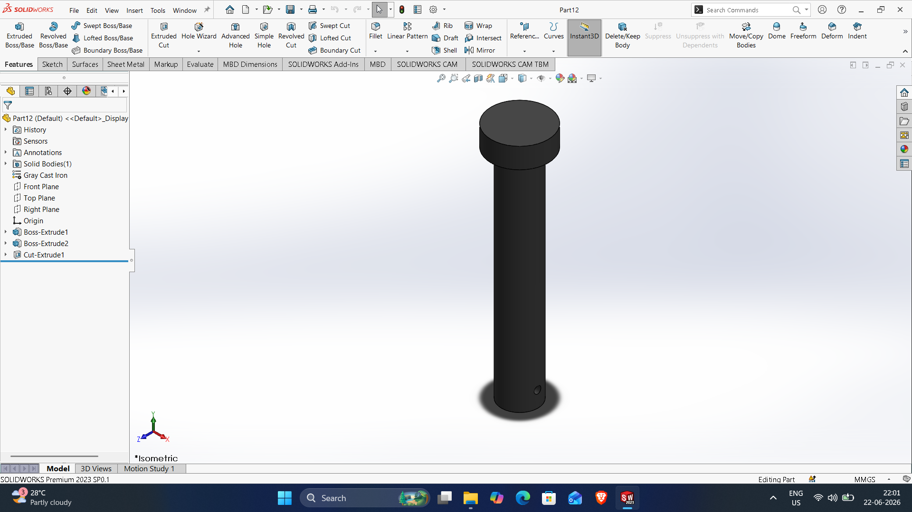
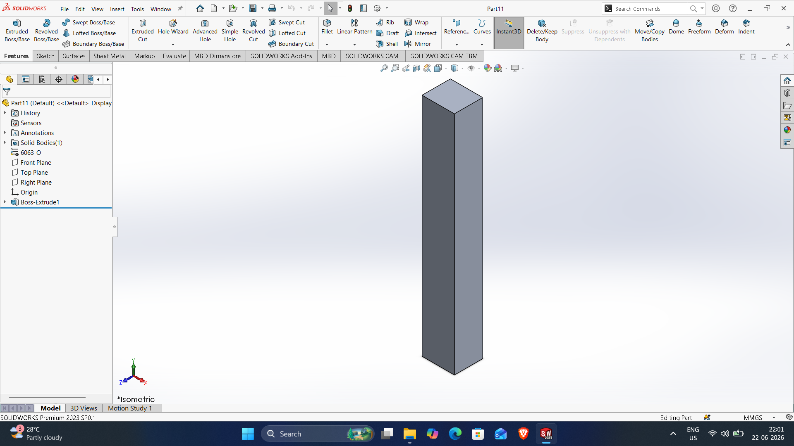
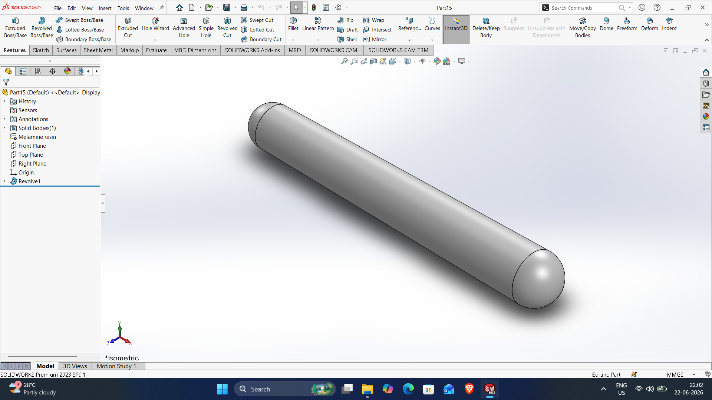
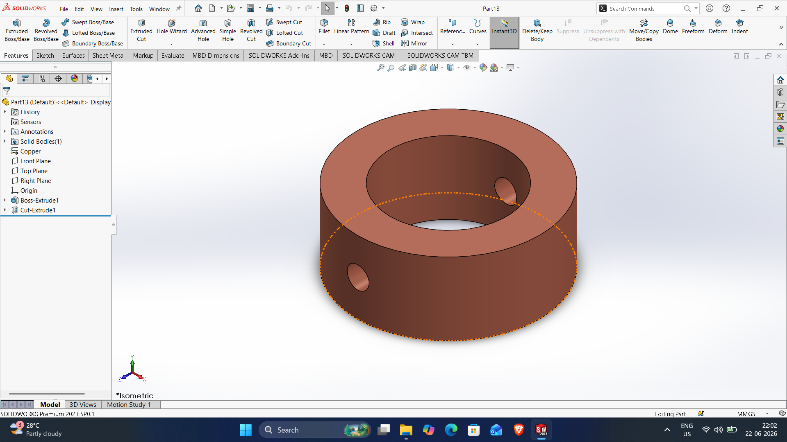
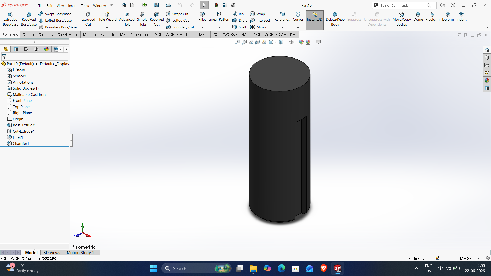

# SOLIDWORKS-ASSEMBLY-FILES

# UNIVERSAL-COUPLING-ASSEMBLY

DWG file: UNIVERSAL-COUPLING-ASSEMBLY.SLDPRT

# part8

DWG file: part8.SLDPRT

# part9

DWG file: part9.SLDPRT

# part2

DWG file: part2.SLDPRT

# part11

DWG file: part11.SLDPRT

# part15

DWG file: part15.SLDPRT

# part13

DWG file: part13.SLDPRT

# part10

DWG file: part10.SLDPRT
