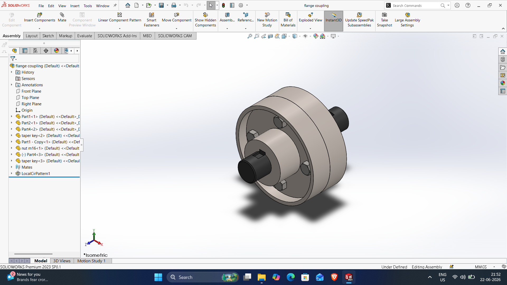
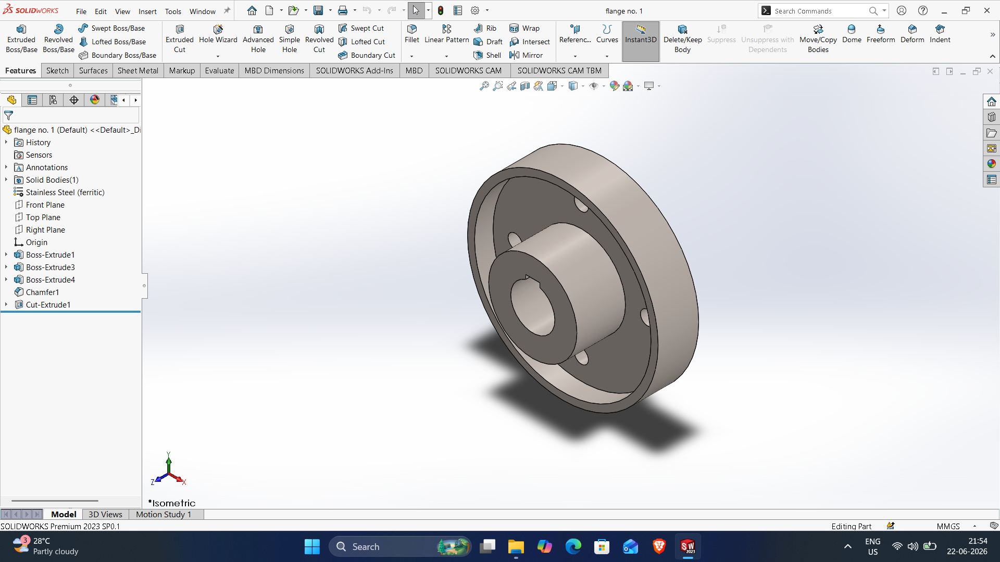
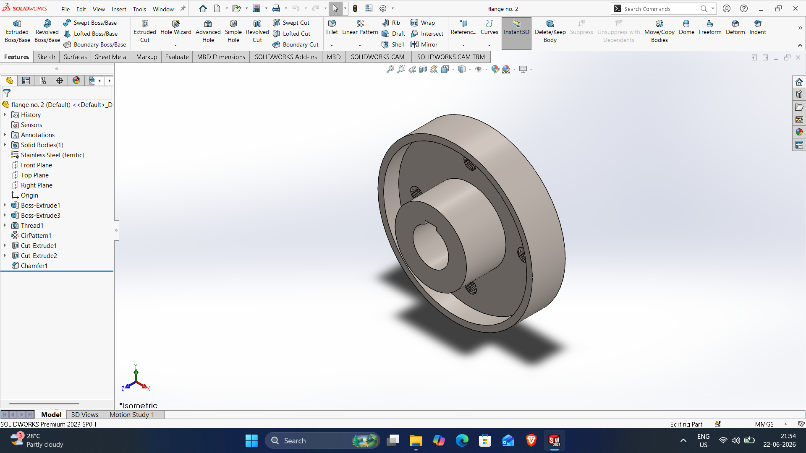
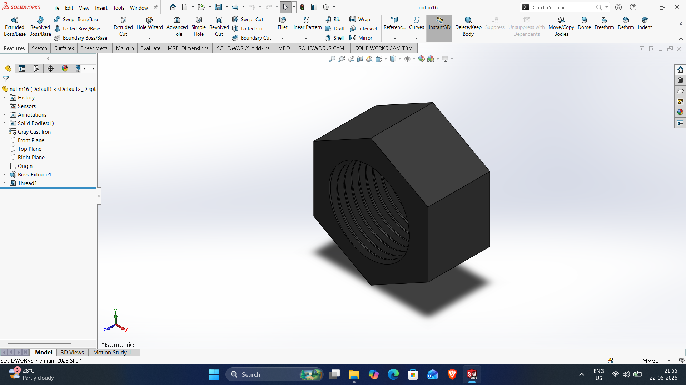
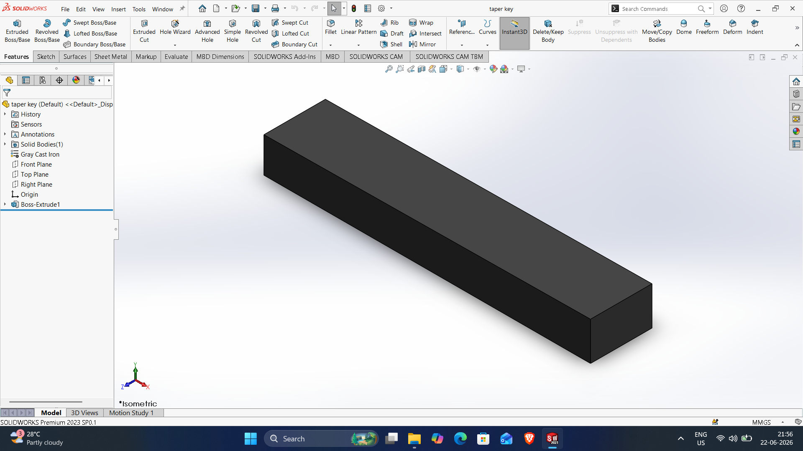

# SOLIDWORKS-ASSEMBLY-FILES

# Flange-coupling-assembly

DWG file: Flange-coupling-assembly.SLDPRT

# bolt

DWG file: bolt.SLDPRT

# flange-no-1

DWG file: flange-no-1.SLDPRT

# flnage-no-2

DWG file: flnage-no-2.SLDPRT

# nut-m16

DWG file: nut-m16.SLDPRT

# Shaft

DWG file: Shaft.SLDPRT

# Taper-key

DWG file: Taper-key.SLDPRT
