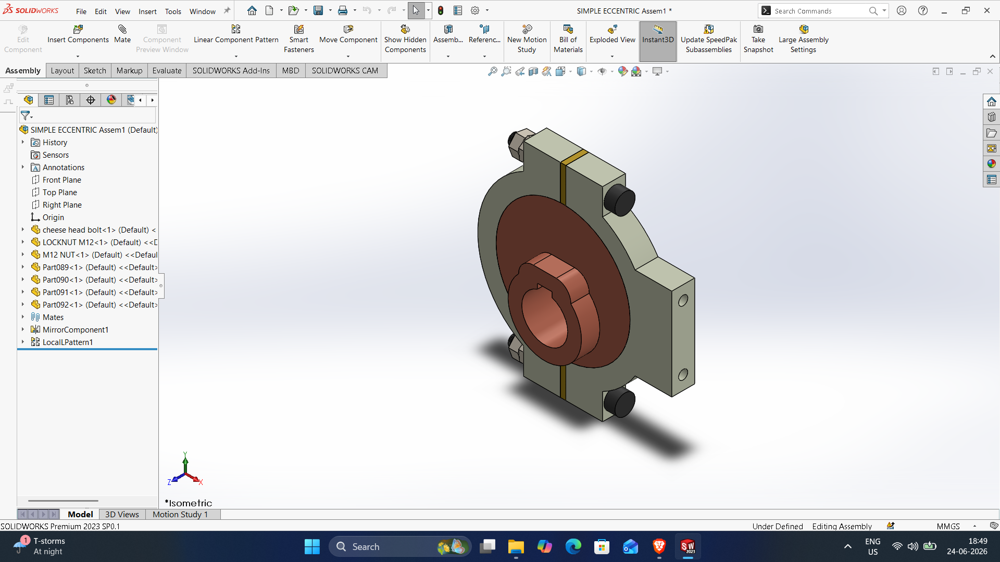
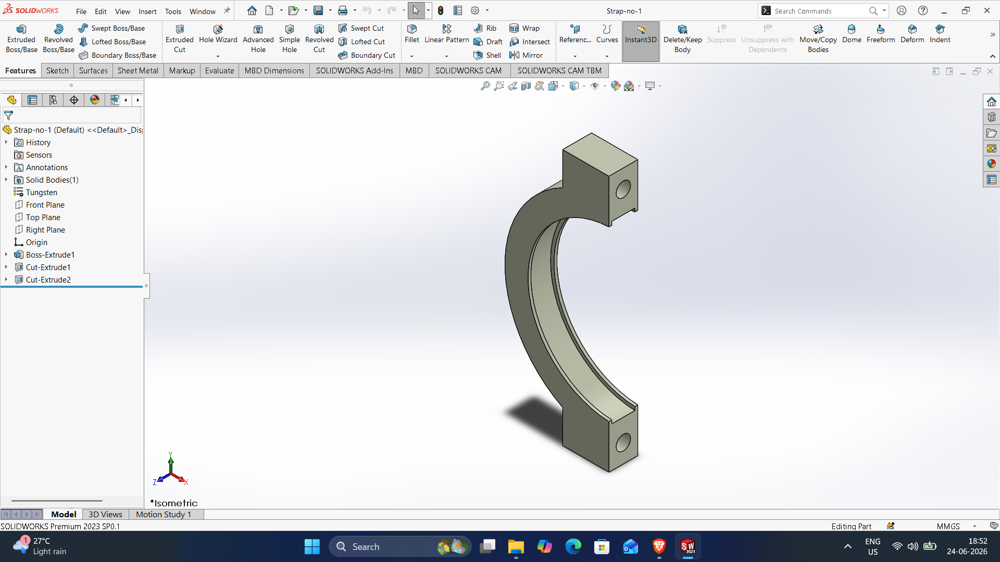
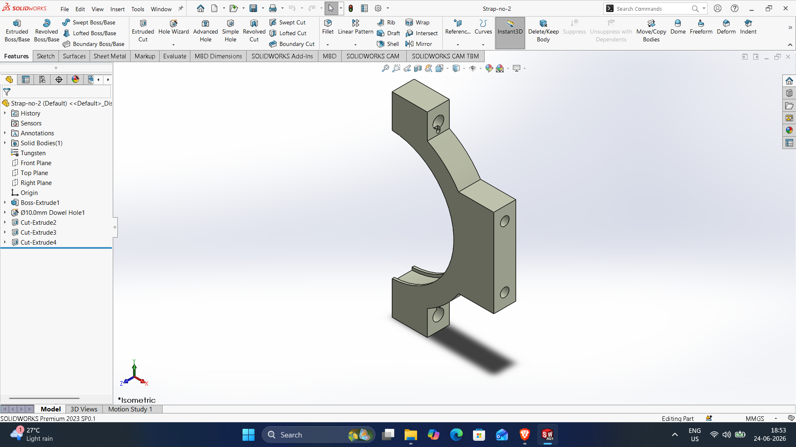
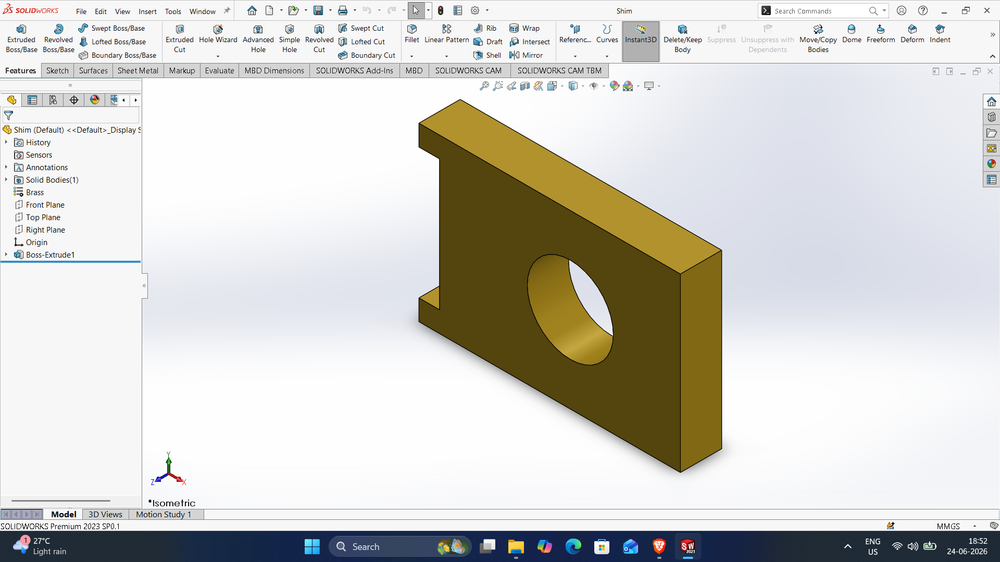
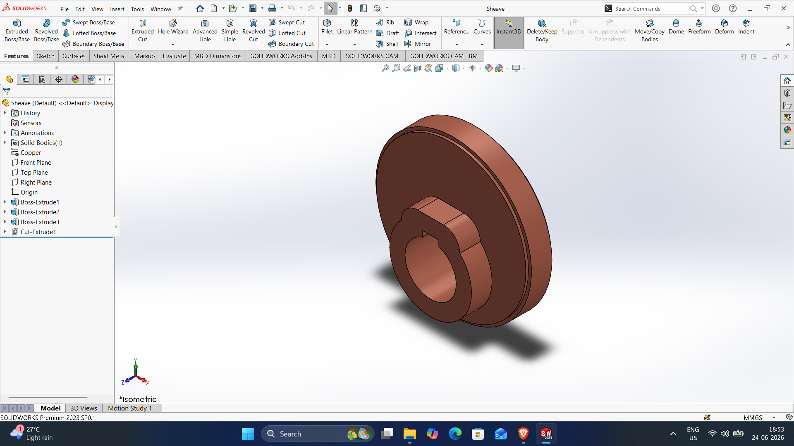
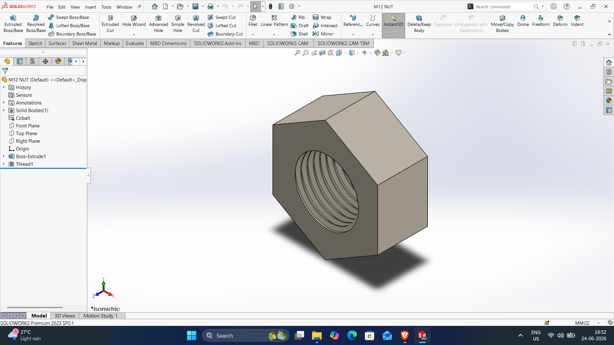
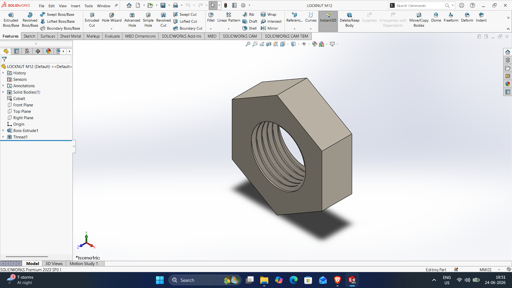
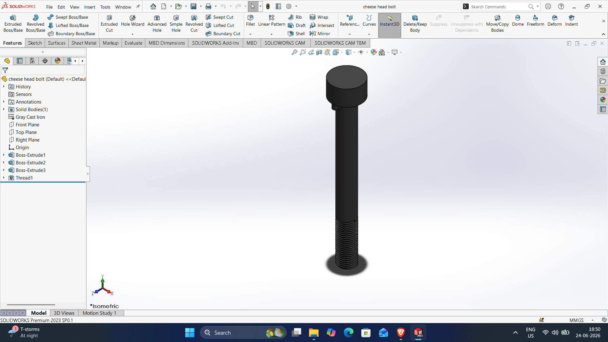

# SOLIDWORKS-ASSEMBLY-FILES
# Simple-Eccentric

DWG file: Simple-Eccentric.SLDASM

# Strap-no-1

DWG file: Strap-no-1.SLDPRT

# Strap-no-2

DWG file: Strap-no-2.SLDPRT

# Shim

DWG file: Shim.SLDPRT

# Sheave

DWG file: Sheave.SLDPRT

# Nut-m12

DWG file: Nut-m12.SLDPRT

# Locknut-M12

DWG file: Locknut-M12.SLDPRT

# Cheese-head-bolt

DWG file: Cheese-head-bolt.SLDAPRT

